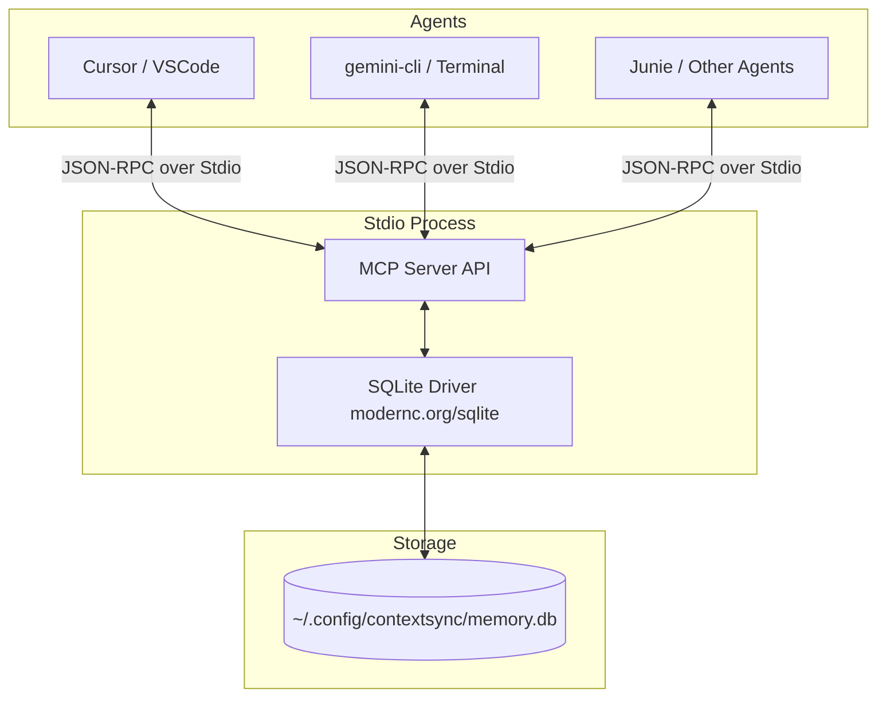

# ContextSync

> **Lightweight, High-Performance Go-Based MCP Shared Memory Bank for Cross-Agent Collaboration**

ContextSync is a zero-overhead, single-binary Model Context Protocol (MCP) server written in Go. Scoped by the absolute path of your workspace directory (`pwd`), ContextSync allows different AI agents (CLI tools, IDE assistants, browser setups) to share an embedded, local SQLite memory bank. It eliminates **"context amnesia"**—when you switch tools, the new agent immediately retrieves the latest goals, current roadblocks, and environment quirks logged by the previous agent.

---

## Features

- **Zero-Daemon Overhead:** No background services, daemons, or server processes to manage. Transactions run directly via the calling agent process.
- **Local & Private:** All data is stored in a pure-Go, CGO-free SQLite database located at `~/.config/contextsync/memory.db`.
- **Workspace Scoped:** Memory is automatically separated and queried based on the absolute repository path.
- **Cross-Agent Memory:** Any fact, roadblock, or state transition recorded by one agent is instantly accessible to other MCP-compatible clients.
- **Flexible Querying:** Supports SQL `LIKE` constraints for keyword searching without complex vector-embedding overhead.

---

## Architecture Overview



---

## Getting Started

### Quick Installation

Run the following command in your terminal to automatically download and install the latest version of ContextSync.

#### Linux and macOS
```bash
curl -fsSL https://raw.githubusercontent.com/sudhir-asuracore/context-sync-mcp/main/install.sh | sh
```

#### Windows (PowerShell)
```powershell
iwr https://raw.githubusercontent.com/sudhir-asuracore/context-sync-mcp/main/install.ps1 | iex
```

---

### Prerequisites
- [Go](https://go.dev/doc/install) (version 1.25 or higher recommended) - *Required only if installing from source.*

### Installation from Source

1. Clone the repository:
   ```bash
   git clone https://github.com/sudhir-asuracore/context-sync-mcp.git
   cd context-sync-mcp
   ```

2. Tidy dependencies and build the binary:
   ```bash
   go mod tidy
   CGO_ENABLED=0 go build -o contextsync
   ```

3. Move the binary to your `PATH` (optional):
   ```bash
   mv contextsync /usr/local/bin/
   ```

---

## MCP Tool API Specifications

ContextSync exposes four simple, highly declarative tools to host LLMs:

### 1. `remember_project_fact`
Persists or updates an engineering fact, configuration quirk, structural target, or decision bound to the current codebase directory.
- **Parameters:**
  - `project_path` (string, Required): Absolute path of the current workspace directory.
  - `topic` (string, Required): The classification header (e.g., `current_roadblock`, `database_setup`, `build_commands`).
  - `fact_content` (string, Required): Concise, dense natural language detailing the knowledge to preserve.
  - `tags` (string, Optional): Comma-separated query tokens.

> [!NOTE]
> If a fact with the same `project_path` and `topic` already exists, ContextSync updates (upserts) the content and tags to keep the context clean and free of stale duplicates.

### 2. `recall_project_facts`
Returns all stored knowledge, historical decisions, and state values for the given workspace path.
- **Parameters:**
  - `project_path` (string, Required): Absolute path of the workspace directory.
  - `search_query` (string, Optional): Keyword string to filter down responses using basic SQL `LIKE` constraints.

### 3. `clear_project_context`
Purges entries for a project when a task lifecycle is completely closed or explicitly reset.
- **Parameters:**
  - `project_path` (string, Required): Absolute path of the workspace directory.
  - `topic` (string, Optional): If provided, deletes only that matching topic slice instead of wiping the whole project footprint.

### 4. `get_usage_stats`
Reports how actively and effectively the ContextSync tools are being called. Every tool invocation is logged to a lightweight `tool_usage` audit table, and this tool returns aggregated analytics rendered as Markdown.
- **Parameters:** None.
- **Returns:** Total call count, calls in the last 24 hours and 7 days, first/last usage timestamps, and a per-tool breakdown (call counts with first/last usage).

---

## Configuration & Agent Integration

### Claude Desktop
To integrate ContextSync with Claude Desktop, add the server to your configuration file:

- **Linux/macOS:** `~/Library/Application Support/Claude/claude_desktop_config.json`
- **Windows:** `%APPDATA%\Claude\claude_desktop_config.json`

```json
{
  "mcpServers": {
    "contextsync": {
      "command": "/usr/local/bin/contextsync",
      "args": []
    }
  }
}
```

If you want to run the server directly using Go without compiling, or use a custom SQLite database file location, you can pass arguments:
```json
{
  "mcpServers": {
    "contextsync": {
      "command": "go",
      "args": [
        "run", 
        "/absolute/path/to/contextsync/main.go",
        "-db",
        "/absolute/path/to/custom/memory.db"
      ]
    }
  }
}
```

### Cursor IDE
1. Open Cursor Settings -> **Features** -> **MCP**.
2. Click **+ Add New MCP Server**.
3. Fill in the details:
   - **Name:** `contextsync`
   - **Type:** `stdio`
   - **Command:** `contextsync` (or the absolute path to your compiled binary)

---

## Developer Guide

### Running Tests
To run the database and helper unit tests:
```bash
go test -v ./...
```

### Internal Debugging
Since MCP utilizes standard output (`stdout`) for its communication channel (JSON-RPC), all log strings, info messages, and debugging info within ContextSync are routed strictly through standard error (`stderr`). 

To inspect runtime outputs while running your agent, check the agent's log output or redirect `stderr` of the process:
```bash
contextsync 2> debug.log
```

---

## Database Schema

```sql
CREATE TABLE IF NOT EXISTS project_memories (
    id INTEGER PRIMARY KEY AUTOINCREMENT,
    project_path TEXT NOT NULL,          -- Scopes context to active repo
    topic TEXT NOT NULL,                 -- Header (e.g., 'auth_bug', 'todo')
    fact_content TEXT NOT NULL,          -- Raw data or status log
    tags TEXT,                           -- Comma-separated descriptors
    created_at DATETIME DEFAULT CURRENT_TIMESTAMP,
    updated_at DATETIME DEFAULT CURRENT_TIMESTAMP
);

CREATE INDEX IF NOT EXISTS idx_project_path ON project_memories(project_path);
CREATE INDEX IF NOT EXISTS idx_topic ON project_memories(topic);

CREATE TABLE IF NOT EXISTS tool_usage (
    id INTEGER PRIMARY KEY AUTOINCREMENT,
    tool_name TEXT NOT NULL,             -- Name of the MCP tool invoked
    project_path TEXT,                   -- Workspace the call was scoped to (if any)
    called_at DATETIME DEFAULT CURRENT_TIMESTAMP
);

CREATE INDEX IF NOT EXISTS idx_tool_name ON tool_usage(tool_name);
CREATE INDEX IF NOT EXISTS idx_called_at ON tool_usage(called_at);
```

---

## License

This project is open-source and available under the [MIT License](LICENSE).
